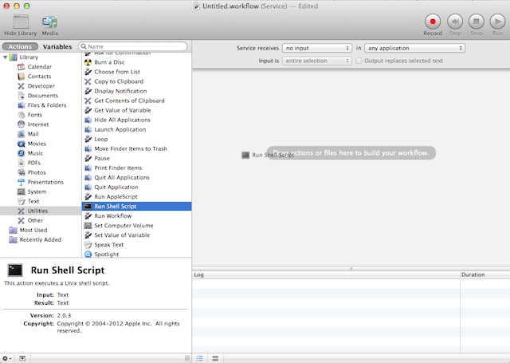

# MacScripts

## generateMethodStubsFromSelection.py

A python script that generate method stubs from selected method declarations and put in clipboard on Mac. It is a more general variation of **generateStubsInClipboardFromSelection.py** in **[xcodeScripts](https://github.com/oliver98844/xcodeScripts)**.

### Installation
You can install by creating Service manually from the script or directly use pre-created Service.
#### - Install by Manually Create Service from generateMethodStubsFromSelection.py
  1. Open Automator  application.
  2. Create a new Automator document with "Service" type. 
  3. Change "Service receives" to "**no input**."
  4. Add a "**Run Shell Script**" action into the workflow at right. 
  5. Change the "Shell" to "**/usr/bin/python**", and paste **generateMethodStubsFromSelection.py** content into the script text area.
  6. Save and give the service name "**Generate Method Stubs**."
  7. Open "**System Preferences**" and go to "**Keyboard**" -> "**Shortcuts**" -> "**Services**." Make sure "**Generate Method Stubs**" is checked and assign a keyboard shortcut to it (eg. **⇧⌥⌘ + C**.)
  
#### - Install with Pre-Created Service.
  1. Move "**Generate Method or Function Stubs.workflow**" into "**/Users/<#YOUR_HOME#>/Library/Services/**."
  2. Do step 7. in "**Install by Manually Create Service from generateMethodStubsFromSelection.py**."

### Usage  
  1. Select some method declarations (include the semicolon "**;**") text in any application that support "Copy".
  2. Trigger the service you have installed by the keyboard shortcut (eg. **⇧⌥⌘ + C**.)
  
  For example:
  In Xcode, you select following code.
  
  	- (void)doSomething;
  	+ (id)objectWithSomething:(id)inSomething;
  	
  Press **⇧⌥⌘ + C**. It will put following code in clipboard.
  
  	- (void)doSomething
  	{
  	}
  	
  	+ (id)objectWithSomething:(id)inSomething
  	{
  	}
  
  Then you can paste the method stubs at anywhere you want.
  
### How it work?

The python code get the method declarations strings by trigger the "Copy" menu item. After get the method declarations in clipboard, it replace all "**;**" to "{}" and put into clipboard.
